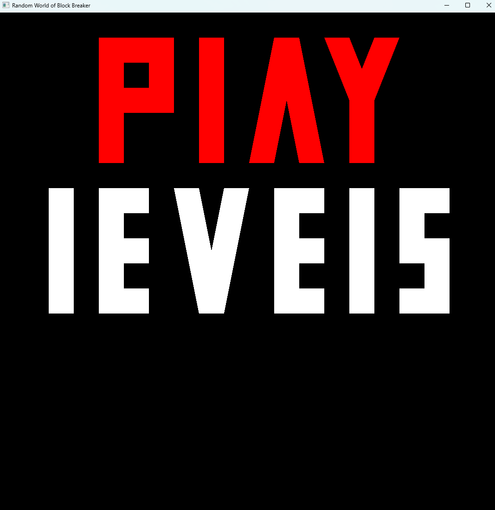
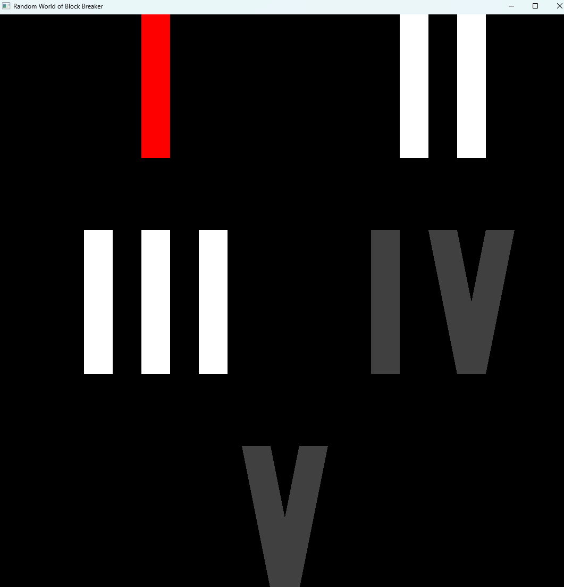
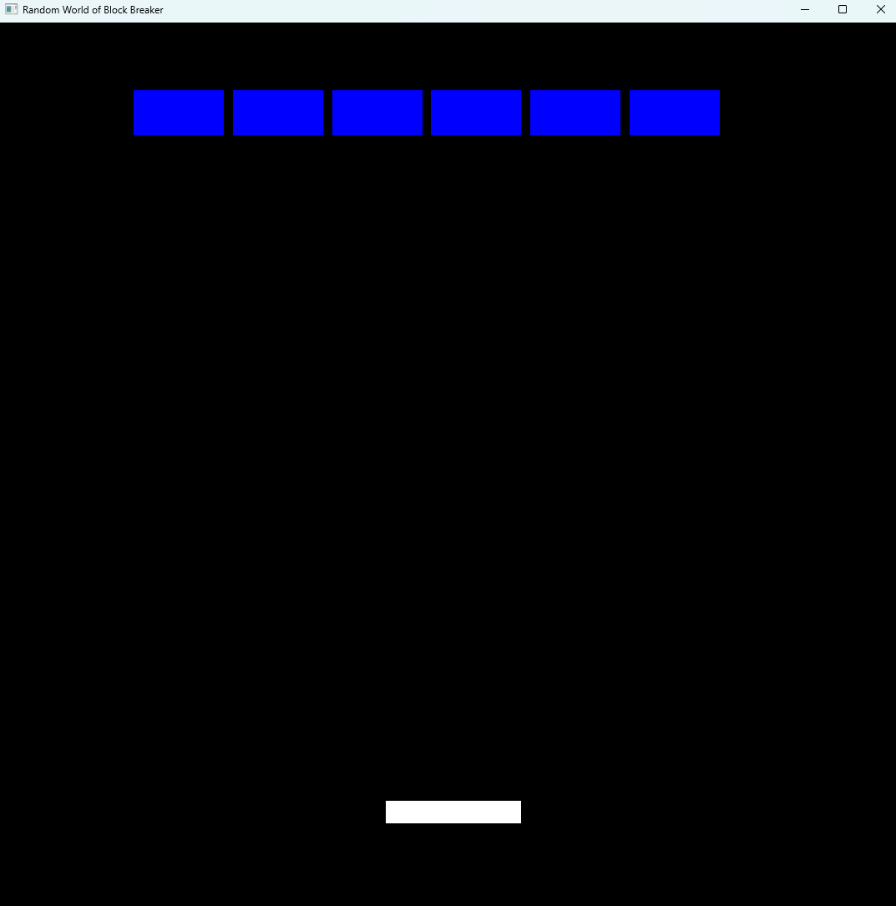
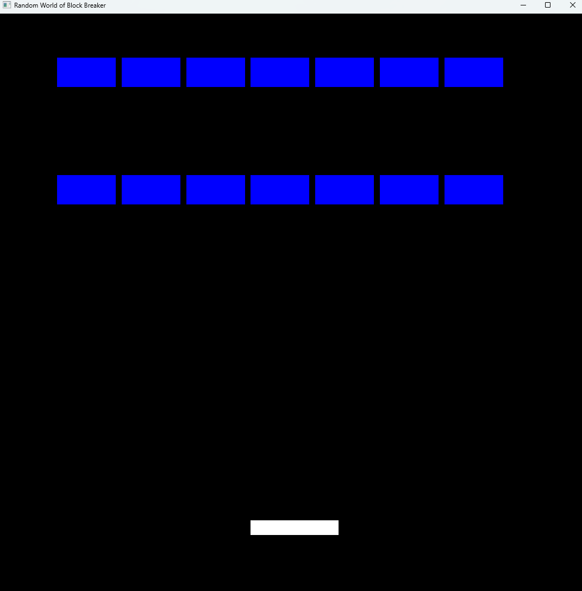
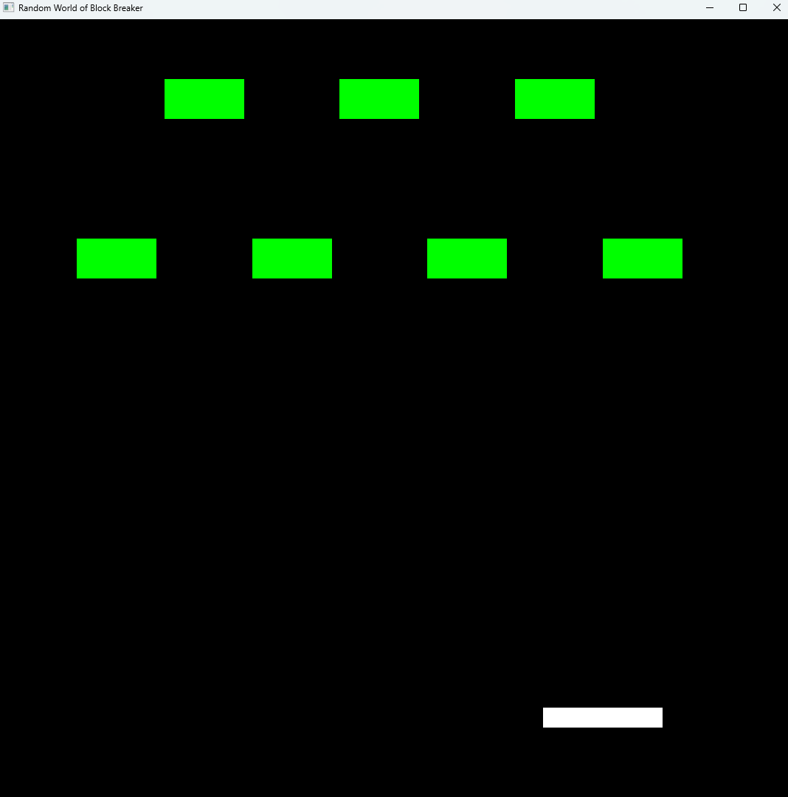
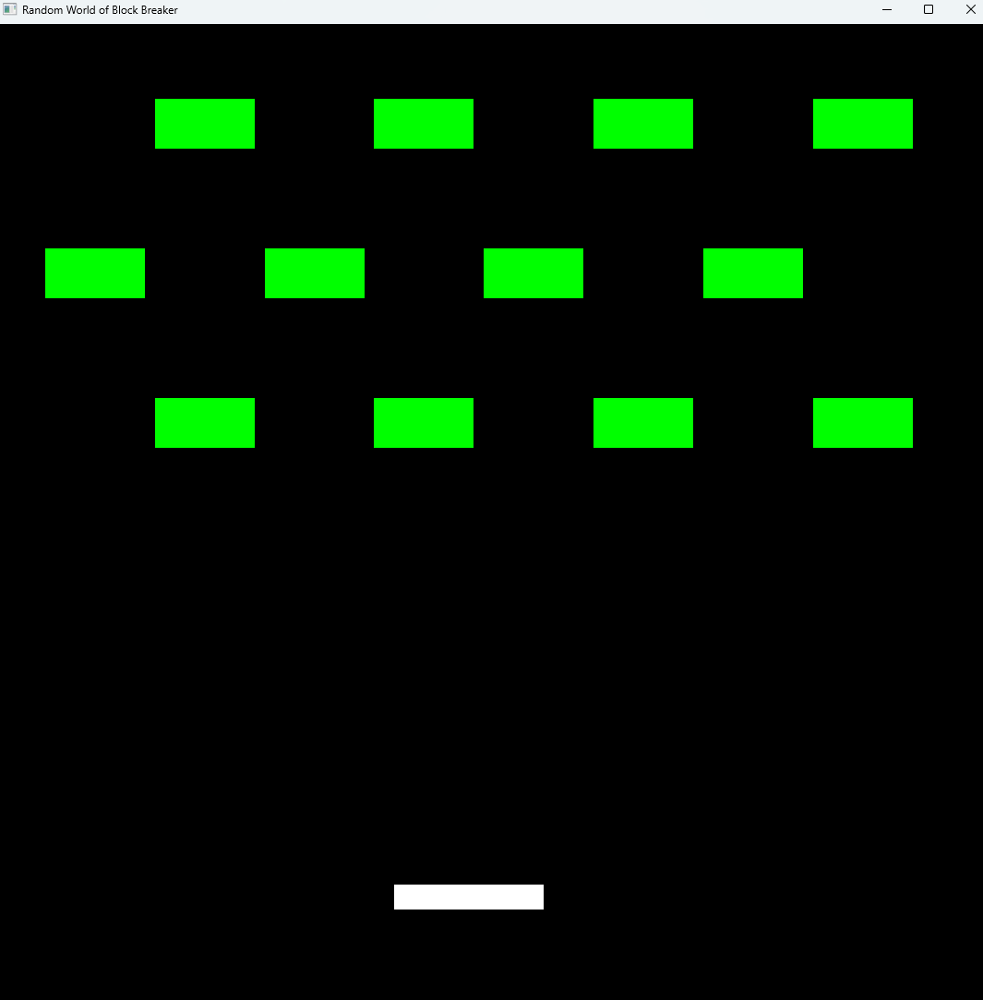

  

# 
 CS-499 Capstone 

## CODE REVIEW

The importance  of a code review is to find issues in the current iteration of the code base and plan fixes and improvements. This ensures the quality of the code meets a minimum expectation held by the developers and company.

<code> Click <a href="https://youtu.be/OiC7sfO8AtQ">HERE</a> to view my submitted code review </code>

## Software design and engineering

The artifact I chose for the Software design and engineering category is the a block breaker game we created in CS330. This game used opengl to draw the bricks, platform, and balls that are displayed on runtime. The reason I chose this project for the artifact was to illustrate my ability to expand an existing project and add the needed functionality that would make this game with a single level into a full game that could potentially be released for public consumption. I added a menu, level selection screen, and multiple new levels. This enhancement also used reading and writing to a local file to store the progress of the player so the dont have to restart from level 1 every time via the level selection screen. I believe the most significant challenge I faced was the implementation of text for the menu and level selection screens. I eventually created methods that I felt were satisfactory in this situation although for a more reusable implementation I would have prefered to create a new class specifically for writing text to the screen. 

  

<code> To view the github for this artifact click <a href="https://github.com/dvSNHU/dvSNHU.github.io/tree/main/Artifacts/1">HERE</a>

## Algorithms and data structure

## Databases

