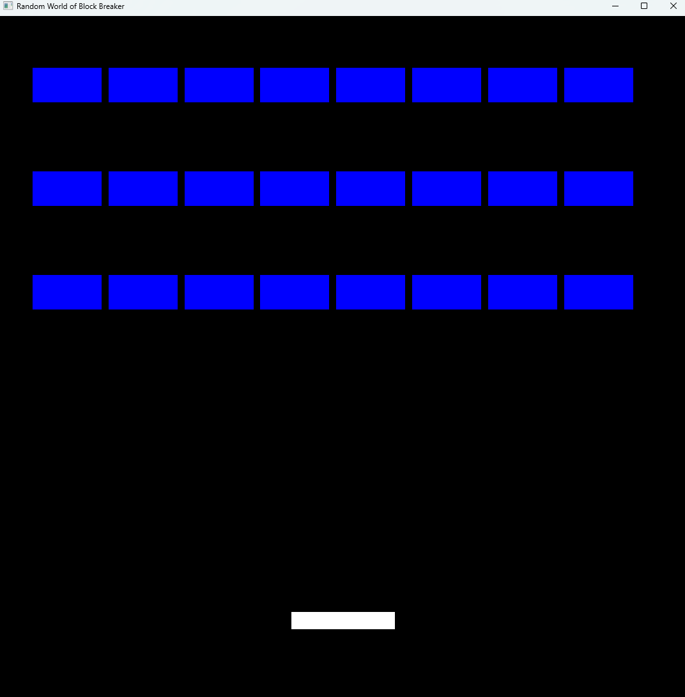
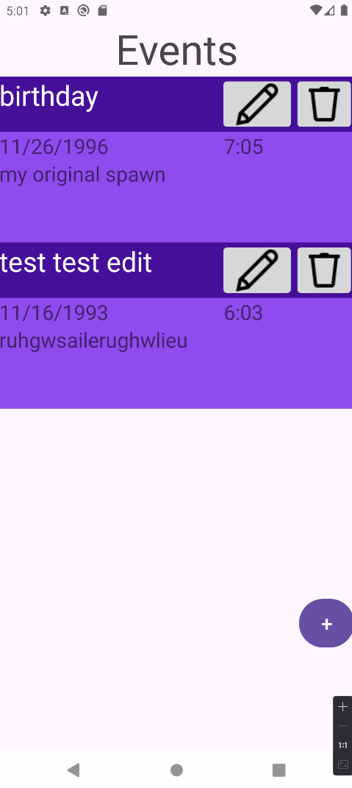

  

# 
 CS-499 Capstone 

## Self-Assessment

The experience I have gained throughout this course will prove valuable as I venture into a new employment territory. While I believe that I already had some good programming experience from personal passion projects, in both basic web design and game development, the practice and knowledge that I have acquired from my classes have really brought home the notion of what kind of a programmer I wish to be. I don’t mean in the specific type of field that I will dive into but the methodology and standards that I will have for myself and, if one day I have the privilege to lead a team, anyone that may work under me. As projects expanded and became more complex the importance of encapsulation and abstraction became more pronounced to make the codebase more maintainable and easier to understand. 

Another skill that I was able to improve throughout these courses was written communication in the form of code documentation and reports. Some examples of these are assignments such as the Software Design Document from CS465, that outlined the functionality and design of the full stack website project for that class, and the security report from CS410, which had us analyze and report security vulnerabilities that were found in a reverse engineered piece of code. These documents illustrate skills in security, software engineering, and communication with stakeholders. The only part that I wish had a higher focus throughout our courses is the ability to do true collaborative work as most assignments, outside of discussion posts, are made for independent work. 

The artifacts that I selected for this portfolio showcase my usage and improvement in the course outcomes for the project. The first artifact is from the CS330 class and was a basic block breaker game that we had started, which I enhanced by adding multiple levels, a main menu, and level select option. This artifact shows my development in the 3rd course outcome, by using algorithmic principles, practices and standards appropriate for the solution, and the 4th, by demonstration well-founded and innovative techniques and skills to add value to the project. The second artifact is a simple paint calculator, from IT145, which calculates how much paint would be needed to paint a wall of dimensions of user input. This artifact was enhanced by rewriting to code to separate the code which validates user input and adding a method to store and load previous calculations. This displays the improvement of the 1st course outcome of using strategies for collaborative environments shown by the creation of independent input validation that can be reused in other projects or by other developers. Finally, the 3rd artifact is from CS360 and is an event tracker app that was made in android studio. This application had the functionality required to create an account, add, delete, and edit events. This was further enhanced by creating an external database and API, then reworking the application to be able to still have all the same functionality with a setup that would be used in an actual product launch. This showcased my understanding of the 2nd course outcome, by using a security mind set when handling sensitive data like passwords, and the 5th, by designing, developing, and delivering communications adapted for specific audiences.

## CODE REVIEW

The importance  of a code review is to find issues in the current iteration of the code base and plan fixes and improvements. This ensures the quality of the code meets a minimum expectation held by the developers and company.

<code> Click <a href="https://youtu.be/OiC7sfO8AtQ">HERE</a> to view my submitted code review </code>

## Software design and engineering

The artifact I chose for the Software design and engineering category is a block breaker game we created in CS330. This game used opengl to draw the bricks, platform, and balls that are displayed on runtime. The reason I chose this project for the artifact was to illustrate my ability to expand an existing project and add the needed functionality that would make this game with a single level into a full game that could potentially be released for public consumption. I added a menu, level selection screen, and multiple new levels. This enhancement also used reading and writing to a local file to store the progress of the player, so they don’t have to restart from level 1 every time via the level selection screen. I believe the most significant challenge I faced was the implementation of text for the menu and level selection screens. I eventually created methods that I felt were satisfactory in this situation although for a more reusable implementation I would have preferred to create a new class specifically for writing text to the screen.

  
  

  
  

  
  

<code> To view the github for this artifact click <a href="https://github.com/dvSNHU/dvSNHU.github.io/tree/main/Artifacts/1">HERE</a>

## Algorithms and data structure

The artifact I chose for the Algorithms and data structure category is a simple paint calculator that was made in the IT-145 course. This project calculated the amount of paint that would be needed to paint a wall of dimensions determined by the user input. This simple program also implemented input validation to ensure that the user input was the correct type to directly use in calculations. I improved this program by creating dedicated input validation functions that were called from the main function. This reduces the repeated code and makes it easier to maintain in the future. I also added the functionality to store and read the calculation history. The reason I chose this program for my second artifact was to showcase my ability to take an existing code base and bring it up to proper standards by factoring out repeated code into its own functions and determine proper data structure requirements to store and read the calculation history which was also stored on an external file while also minimizing the amount of data that needed to be stored externally.

  
  

<code> To view the github for this artifact click <a href="https://github.com/dvSNHU/dvSNHU.github.io/tree/main/Artifacts/2">HERE</a>

## Databases

The artifact I chose for the Databases category is the event tracker that was made in CS-330. This program is an event tracker app that is made in android studio. It offers the ability to create an account, add events, edit events, and delete them as well. When this application was made, it used a local database instance to store and read the information entered by the user when making an account and events. I chose this application for the 3rd artifact to show my ability to create and set up a database, backend API, and integrate them with a client-side application. The API I created acted as the middleman that allowed the client to verify user credentials and retrieve their personal events. It also added a layer of security for the database from unapproved access. Lastly, the application was also rewritten, to an extent, to use this new API and use encryption of user passwords to ensure data is not transmitted between networks as plain text. The main challenge I faced when implementing this enhancement was learning how to make and receive http requests to make the API calls and get the returned data to be used within the app.

  
  

<code> To view the github for this artifact click <a href="https://github.com/dvSNHU/dvSNHU.github.io/tree/main/Artifacts/3">HERE</a>
